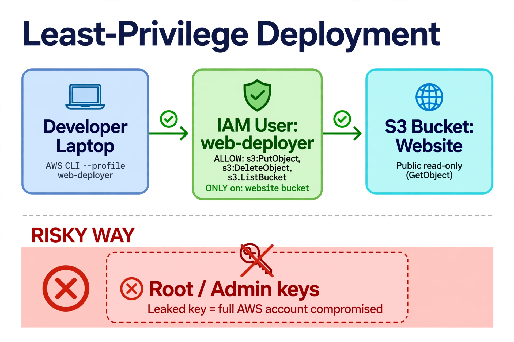

# Project 1: Static Website on S3 + Least-Privilege IAM

Live site: http://umer-cloud-journey-2026.s3-website.ap-south-1.amazonaws.com

## What I built

A static portfolio website hosted on Amazon S3, deployed through a locked-down IAM identity following the principle of least privilege.

## Architecture

Traffic flow: Developer laptop → IAM user `web-deployer` (scoped policy) → S3 bucket (public read-only) → visitors.

## Key files

- `index.html` — the website
- `bucket-policy.json` — allows public `s3:GetObject` only; no public write, ever
- `iam-deploy-policy.json` — the deploy user's inline policy: `PutObject`, `DeleteObject`, `ListBucket` on this bucket only

## What I proved

- Deployed v2 of the site using only the `web-deployer` credentials (`aws s3 cp ... --profile web-deployer`) — no admin keys touched
- Negative test: `get-bucket-policy` with the deploy user returns **AccessDenied** — the permission boundary holds
- Enabled S3 versioning and practiced rollback by deleting a specific version
- Verified no root access keys exist on the account

## Why least privilege matters

In production, deployments run under scoped identities, not admin keys. If a deploy key leaks (stolen laptop, accidental commit to GitHub), the blast radius is limited to one bucket instead of the whole AWS account. This is the first thing security teams audit — and now it's muscle memory.
